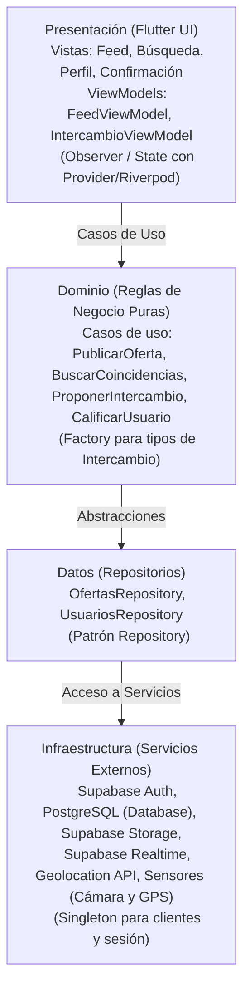

# Swappia 🤝🔄
> *"Lo que tú tienes, alguien más lo necesita."*

Aplicación móvil de trueque e intercambio de servicios y bienes entre vecinos de una misma colonia o comunidad en **Dolores Hidalgo, C.I.N., Guanajuato**.

---

## 📌 Datos Institucionales y Equipo

* **Institución:** Universidad Tecnológica del Norte de Guanajuato ([UTNG](https://www.utng.edu.mx/))
* **Área:** Tecnologías de la Información — Ingeniería en Desarrollo y Gestión de Software
* **Materia:** Desarrollo Móvil Integral (Unidad de aprendizaje: *Definición del proceso de desarrollo móvil*)
* **Profesor:** Barrientos Avalos José de Jesús Eduardo
* **Grupo:** GIDS6101-E

### Integrantes del Equipo
| Nombre | Matrícula |
| :--- | :--- |
| **Aguayo Santana Carlos Samael** | `1223100396` |
| **Loredo Melendez José de Jesús** | `1223100429` |
| **Pardo Zamarripa Juan Diego** | `1223100425` |

---

## 📖 Planteamiento del Problema y Propuesta de Valor

### El Problema
En colonias y comunidades semi-rurales cercanas a Dolores Hidalgo existen tres fricciones principales:
1. **Falta de visibilidad de oficios locales:** Personas con oficios (electricistas, costureras, quienes hacen mandados, artesanos de talavera/cerámica) dependen exclusivamente del boca en boca y carecen de un canal digital accesible para darse a conocer en su entorno inmediato.
2. **Desperdicio de bienes útiles:** Existen productos y bienes en buen estado sin usar porque venderlos tradicionalmente implica negociar con desconocidos o plataformas impersonales.
3. **Comercio informal basado en confianza:** El comercio informal y tianguis operan sobre la confianza vecinal, pero sin una herramienta digital comunitaria que respalde acuerdos ni reputación.

### La Solución: Swappia
Swappia digitaliza y potencia la confianza vecinal a través de un canal hiperlocal que permite:
* Crear un **perfil vecinal único** para publicar *"Lo que ofrezco"* y *"Lo que busco"*.
* **Emparejamiento geolocalizado** dentro del radio de la colonia o comunidad mediante consultas espaciales en PostgreSQL.
* **Modalidad de pago flexible:** Trueque puro, dinero en efectivo o combinación mixta.
* **Reputación vecinal:** Sistema de calificaciones entre vecinos reales para fomentar la seguridad y confianza comunitaria.

---

## 🚀 Alcance del Proyecto & Funcionalidades

### MVP (Producto Mínimo Viable — Indispensable)
- [x] **Inicialización y configuración base de arquitectura por capas.**
- [ ] **Registro e inicio de sesión** (Supabase Auth - perfil vecino).
- [ ] **Publicar oferta o necesidad** (Servicios u oficios y bienes materiales con fotos y descripción).
- [ ] **Búsqueda y filtros hiperlocales** por colonia/comunidad y categorías.
- [ ] **Proponer intercambio:** Selección de tipo de acuerdo (dinero, trueque o mixto).
- [ ] **Confirmación del intercambio.**
- [ ] **Calificar tras el intercambio** (reputación vecinal).

### Roadmap Futuro
- [ ] Sistema de puntos *"Manzanas"* para trueques indirectos y acumulativos.
- [ ] Chat en tiempo real integrado con Supabase Realtime.
- [ ] Notificaciones push de oportunidades cercanas.
- [ ] Verificación de identidad avanzada de vecinos.
- [ ] Integración con comercios y artesanos locales registrados.

---

## 🏛️ Arquitectura de Software

El proyecto implementa una arquitectura **MVVM (Model - View - ViewModel) estructurada por capas**, garantizando separación de responsabilidades, reactividad en tiempo real y facilidad de pruebas.



### Capas del Sistema
1. **Presentación (`lib/presentation/`):** Vistas (`screens`/`views`), componentes reutilizables (`widgets`) y `viewmodels` que gestionan el estado y reaccionan ante cambios.
2. **Dominio (`lib/domain/`):** Entidades de negocio, contratos/interfaces de repositorios y casos de uso (`usecases`) independientes de librerías externas.
3. **Datos (`lib/data/`):** Implementación de los repositorios y fuentes de datos remotas (`SupabaseDataSource`) y locales (`HiveDataSource`).
4. **Infraestructura / Core (`lib/core/`):** Configuración del cliente Supabase, manejo de errores, utilidades de geolocalización/sensores y constantes.

---

## 🧩 Patrones de Diseño Implementados

* **Repository:** Desacopla la lógica de negocio de Supabase y PostgreSQL, permitiendo cambiar o complementar la persistencia (ej. caché offline con Hive) sin tocar la interfaz ni el dominio.
* **Observer / State:** Mantiene la UI sincronizada reactivamente con el ViewModel mediante listeners o streams en tiempo real (Supabase Realtime).
* **Factory:** Centraliza la creación flexible de instancias de `Intercambio` según su tipo (`Dinero`, `Trueque` o `Mixto`).
* **Singleton:** Gestiona una única instancia global del cliente de Supabase (`Supabase.instance.client`) y la sesión del usuario autenticado.

---

## 🛠️ Stack Tecnológico

| Área | Tecnologías |
| :--- | :--- |
| **Frontend Móvil** | [Flutter](https://flutter.dev/) + [Dart](https://dart.dev/) |
| **Backend & Base de Datos** | [Supabase](https://supabase.com/) ([PostgreSQL](https://www.postgresql.org/) relacional + soporte geoespacial) |
| **Autenticación** | Supabase Auth (Email / Teléfono / Contraseña) |
| **Almacenamiento Multimedia** | Supabase Storage (Fotos de artículos, oficios y avatares) |
| **Sincronización en Tiempo Real** | Supabase Realtime (WebSockets para cambios en acuerdos y feed) |
| **Persistencia Local / Offline** | [Hive](https://pub.dev/packages/hive) (Caché local rápido) |
| **Geolocalización & Sensores**| Geolocator / Google Maps API, Image Picker (Cámara), GPS |
| **Gestión de Estado** | Provider / Riverpod |
| **Diseño & Prototipado** | Figma |
| **Metodología y Gestión** | Scrum (Sprints de 1-2 semanas), GitHub Projects, Kanban |

---

## 🌿 Flujo de Trabajo y Versionamiento (Git)

Se utiliza una estrategia de ramificación basada en Gitflow simplificado:
* `main`: Código estable y listo para entrega/producción.
* `develop`: Rama principal de integración y desarrollo activo.
* `feature/<nombre-funcionalidad>`: Ramas de características específicas creadas a partir de `develop`.

### Convención de Commits (Conventional Commits)
Los mensajes de commit deben ser descriptivos y seguir el formato:
* `feat:` Nueva funcionalidad para el usuario.
* `fix:` Corrección de algún error o bug.
* `docs:` Cambios exclusivamente en documentación (ej. `README.md`).
* `refactor:` Reestructuración de código sin alterar su comportamiento externo.
* `test:` Adición o corrección de pruebas unitarias o de widgets.
* `chore:` Tareas de mantenimiento, dependencias o configuración del proyecto.

---

## 🧪 Estrategia de Pruebas

* **Unitarias:** Validación aislada de los casos de uso, lógica de emparejamiento, cálculo de reputación y ViewModels mediante mocks.
* **Widgets / UI:** Verificación del comportamiento visual de formularios, validaciones de campos y vistas de listas/búsqueda.
* **Integración:** Comprobación del flujo completo: `Publicar oferta -> Buscar en colonia -> Proponer intercambio -> Confirmar -> Calificar`.
* **Pruebas de Usuario (Piloto):** Validación con vecinos reales en 2 o 3 colonias piloto de Dolores Hidalgo.

---

## 💻 Instalación y Configuración Local

### Prerrequisitos
* [Flutter SDK](https://docs.flutter.dev/get-started/install) (versión compatible con Dart SDK `>=3.12.2`).
* Dispositivo físico Android (con depuración USB habilitada) o emulador de Android Studio.
* Proyecto en [Supabase](https://supabase.com/) con credenciales de API (`SUPABASE_URL` y `SUPABASE_ANON_KEY`).

### Pasos para ejecutar
1. **Clonar el repositorio:**
   ```bash
   git clone https://github.com/juanpaa777/swappia.git
   cd swappia/swappia_app
   ```

2. **Instalar dependencias:**
   ```bash
   flutter pub get
   ```

3. **Configurar variables de entorno:**
   Crear un archivo `.env` en la raíz con las credenciales de Supabase:
   ```env
   SUPABASE_URL=https://tu-proyecto.supabase.co
   SUPABASE_ANON_KEY=tu-anon-key-de-supabase
   ```

4. **Ejecutar en modo de desarrollo:**
   ```bash
   flutter run
   ```
